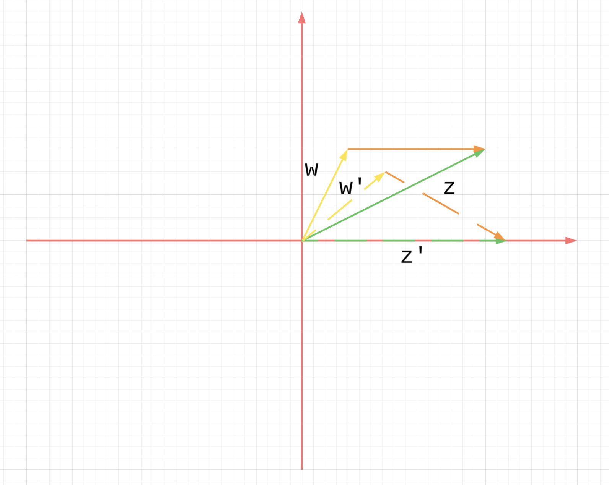
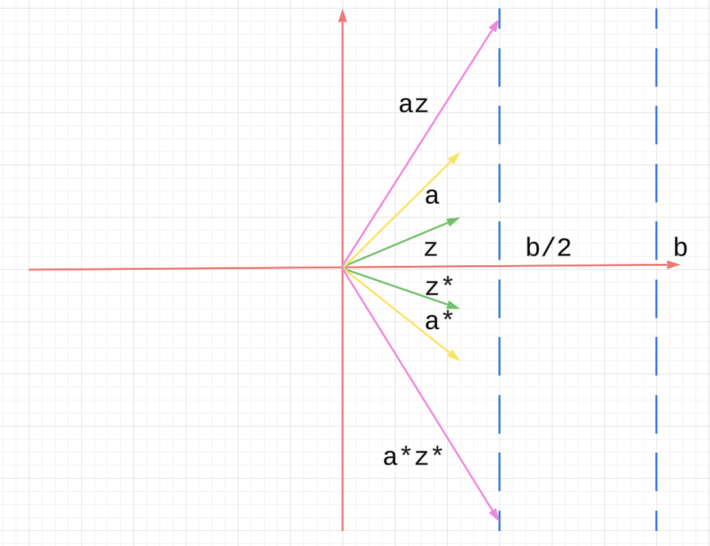
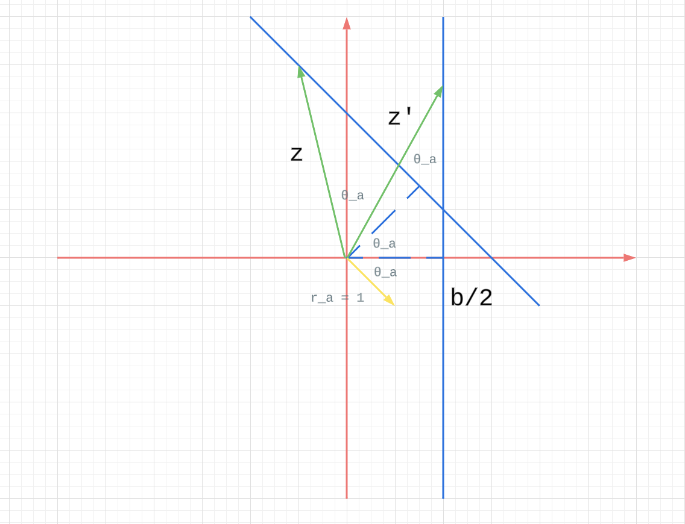

# Appendix B Complex Numbers and Complex Exponentials

## B.1. Complex Numbers

$$ 
i = \sqrt[]{-1}
$$

By the way, read $-i$  as “minus $i$” not “negative $i$.” To say 
$−i$ is “negative $i$” would imply that $i$ is positive, and it 
isn’t. 

This is because we can not have an order on $\mathbb{C}$.

The complex conjugate of $z = x+iy$ is $\bar{z} = x - iy$.

We have

$$ 
\overline{z + w} = \overline{z} + \overline{w},
\overline{zw} = \overline{z}\overline{w},
\overline{\overline{z}} = z \\
x = \text{Re} z = \frac{z + \overline{z}}{2} \\
y = \text{Im} z = \frac{z - \overline{z}}{2i} \\
$$

For the integral

$$ 
\overline{
\int_{a}^{b}f(t) g(t) dt
} =
\int_{a}^{b}
\overline{f(t)}
\overline{g(t)} dt
$$

We can also right

$$ 
\left( 
\int_{a}^{b}f(t) g(t) dt
\right)^*
=
\int_{a}^{b}
f(t)^* 
g(t)^*
dt
$$

The magnitude of $z = x+iy$ is

$$ 
|z| = \sqrt[]{x^2 + y^2}
$$

We also have

$$ 
|z|^2 = z \overline{z} \\
|z+w|^2 =|z|^2 + 2 \text{Re} \{\overline{z}w\} + |w|^2
$$

Polar form

For $z = x + yi$, we can also write it as

$$ 
x + yi = r \cos θ+ i r \sin θ = r (\cos θ+ i \sin θ) 
$$

## B.2. The Complex Exponential and Euler’s Formula

Define

$$ 
e^z = 1 + z +
\frac{z^2}{2!} +
\frac{z^3}{3!} +
\cdots 
= \sum_{n = 0}^{\infty} \frac{z^n}{n!}
$$

This converges for all $z ∈ \mathbb{C}$, but we won’t check that.

Also we have

$$ 
\overline{e^z} = e^{\bar{z}}
$$

To prove

$$ 
e^{z+w} = e^z e^w
$$

Notice if $f = e^z$ then $f' = f, f(0) = 1$.

And if we fix $w$, we have

$$ 
\frac{d}{dz} e^{w+z} = e^{w+z}
$$

From the knowledge of difference equation, we must have

$$ 
e^{w+z} = c e^z
$$

Then plug $z = 0$, we have $c = e^w$.

### Euler’s formula

$$ 
f(θ) = e^{i θ} = \cos θ + i \sin θ = g(θ)
$$

The left-hand side has only been defined via a series.
The exponential function in the real case has nothing to do with 
the trig functions sine and cosine, and why it should have 
anything to do with them in the complex case is a true wonder.

Use some results for differential equations (the results themselves 
are difficult).

Note $f(0) = 1, f'(θ) = i e^{iθ}$, so $f'(0) = i$.
Moreover

$$ 
f''(θ) = - e^{iθ} = -f(θ)
$$

i.e. $f$ satisfy

$$ 
f'' + f = 0, f(0) = 1, f'(0) = i
$$

On the other hand

$$ 
g''(θ) = (-\sin θ + i \cos θ)' = - (\cos θ + i \sin θ) = - g(θ) \\
$$ 

So we have

$$ 
g'' + g = 0, g(0) = 1, g'(0) = i
$$

Thus $f$ and $g$ satisfy the same differential equation with the 
same initial conditions; so $f$ and $g$ must be equal. Slick.

$\square$

Plugging $θ = π$ into Euler’s formula, we have

$$ 
e^{i \pi} + 1 = 0
$$

This is sometimes referred to as the most famous equation in 
mathematics. It expresses a simple relationship — and why should 
there be any at all? — between the fundamental numbers $e, π, 1,$ 
and $0$, not to mention $i$. We’ll probably never
see this most famous equation again, but now we’ve seen it once.

### Consequences of Euler’s formula.

$$ 
z = r (\cos θ + i \sin θ) = r e^{iθ}
$$

Then the multiplication of 2 complex numbers is

$$ 
z_1 z_2 = r_1 r_2
e^{i(θ_1 + θ_2)}
$$

We also have a dead easy way of deriving the addition formulas
for the sine and cosine

$$
\begin{split}
e^{i(α+β)}
&= e^{iα} e^{iβ} \\
&= (\cos α + i \sin α)(\cos β + i \sin β) \\
&=  (\cosα\cosβ−\sinα\sinβ)+i(\sinα\cosβ +\cosα\sinβ)
\end{split}
$$

On the other hand

$$ 
\begin{split}
e^{i(α+β)} = \cos (α+β) + i \sin (α+β)
\end{split}
$$

So we have

$$
\cos(α+β) = \cosα\cosβ−\sinα\sinβ, \\
\sin(α+β) = \sinα\cosβ +\cosα\sinβ.
$$

Quote from the author:

I went through this derivation because it expresses in a simple 
way an extremely important principle in mathematics and its 
applications.

* ***If you can compute the same thing two different ways, chances 
  are you’ve done something significant.***

Take this seriously. This maxim appears throughout the course.

### Symmetries of the sine and cosine: Even and odd functions.

Use this

$$ 
\overline{e^{iθ}} = e^{\overline{iθ}} = e^{-iθ}
$$

We have

$$ 
\cos θ = \frac{e^{iθ} + e^{-iθ}}{2},
i\sin θ = \frac{e^{iθ} - e^{-iθ}}{2}.
$$

Note $\cos$ is an even function and $\sin$ is an odd function.

Why is this true? There are many ways of seeing it (Taylor series, 
differential equations), but here’s one you may not have thought of 
before, and it fits into a general framework of evenness and 
oddness that we’ll find useful when discussing symmetries of the 
Fourier transform.

Given any function $f(x)$,

$$ 
f_e = \frac{f(x) + f(-x)}{2} \\
f_o = \frac{f(x) - f(-x)}{2}
$$

The top one is an even function and the bottom one is an odd
function.

### Algebra and geometry.

$$ 
|e^{iθ}| = \sqrt[]{
\cos^2 θ + \sin^2 θ
} = 1
$$

## B.3. Further Applications of Euler’s Formula

For additional applications we’ll replace $θ$ by $t$ and
think of

$$ 
e^{it} = \cos t + i \sin t
$$

we see that $e^{it}$ is a (complex-valued) parametrization of the 
circle: the circle is traced out exactly once in the 
counterclockwise direction as t goes from $0$ to $2π$.

For our efforts we prefer to work with

$$ 
e^{i2πt} = \cos (2πt) + i \sin (2πt)
$$

the complex exponential $e^{2πit}$ contains the sinusoids
$\cos 2πt$ and $\sin 2πt$, each of frequency 1 Hz.

With the $2π$, as $t$ goes from $0$ to $1$ the point $e^{2πit}$ 
traces out the unit circle exactly once (one cycle) in a counter 
clockwise direction.

The units in the exponential $e^{2πit}$ are (as they are in $\cos 2πt$ and $\sin 2πt$)

$$ 
e^{
(2π \text{ radians/cycle}) \cdot
i \cdot 1 (\text{ cycle/sec}) \cdot
(t \text{ sec})
}
$$

Without the $2π$ the units in $e^{it}$ are

$$ 
e^{
i \cdot (1 \text{ radians/cycle})
\cdot
(t \text{ sec})
}
$$

### change the amplitude and frequency and to include a phase shift

The general complex exponential that includes this
information is then

$$ 
A e^{i(2πνt + \phi)}
$$

* Then the point traces out the circle in the counterclockwise direction at a rate of $ν$ cycles per second;
* The phase $\phi$ determines the starting point on the circle, 
  for at $t = 0$ the point is $A e^{i\phi}$

In fact, we can write

$$ 
A e^{i(2πνt + \phi)} = e^{2πiνt} A e^{i\phi}
$$

We can think of this as the (initial) vector $Ae^{i\phi}$ set 
rotating at a frequency $ν$ Hz through
multiplication by the time-varying phasor $e^{2πiνt}$.

What happens when $ν$ is negative? That simply reverses the 
direction of motion around the circle from counterclockwise to 
clockwise. The catch phrase is just so:
* positive frequency means counterclockwise rotation
* negative frequency means clockwise rotation.

### Sums of sinusoids.

What one can say about the superposition of two signals?

$$ 
A_1 \sin (2πνt + \phi_1) +
A_2 \sin (2πνt + \phi_2)
$$

Consider

$$ 
A_1 e^{i(2πνt + \phi_1)} +
A_2 e^{i(2πνt + \phi_2)}
$$

whose imaginary part is the sum of sinusoids, above. Before 
messing with the algebra, think geometrically in terms of rotating 
vectors. At $t = 0$ we have the
two vectors from the origin to the starting points

$$ 
z_0 = A_1 e^{iφ_1},
w_0 = A_2 e^{iφ_2}.
$$

Their sum $z_0 +w_0$ is the starting point (or starting vector) 
for the sum of the two motions. But how do those two starting 
vectors move? They rotate together at the same rate, the motion of 
each described by $e^{2πiνt}z_0$ and $e^{2πiνt}w_0$, respectively.
Thus their sum also rotates at that rate — think of the whole 
parallelogram (vector sum) rotating rigidly about the vertex at 
the origin.

Now mess with the algebra and arrive at the same result:

$$ 
A_1 e^{i(2πνt + \phi_1)} +
A_2 e^{i(2πνt + \phi_2)}
=
e^{i2πνt} (
A_1 e^{i\phi_1} +
A_2 e^{i\phi_2}
)
$$

## Problems and Further Results

### B.1. 

If $0 ≤ \arg w − \arg z < π$, show that the area of the triangle whose vertices are $0$, $z$, and $w$ is given by

$$ 
\frac{1}{2} \Im \{\overline{z}w\}
$$

**Proof**:

Assume $z, w$ is shown in the figure below.

$$ 
w = r_1 e^{iθ_1},
z = r_2 e^{iθ_2}
$$

Then if we rotate the triangle until $z$ is completely on
$x$-axis, then we can see the area is

$$ 
\frac{1}{2} r_2 \cdot r_1 \cdot \sin (θ_1 - θ_2)
$$

Also note

$$ 
\overline{z}w\ = r_2 e^{-iθ_2} r_1 e^{iθ_1} \\
= r_2 r_1 e^{i(θ_1-θ_2)} \\
= r_2 r_1 (\cos (θ_1-θ_2) + i \sin (θ_1-θ_2))
$$

So we have $A = \frac{1}{2}\Im \{\overline{z}w\}$.

$\square$

### B.2.

Show that the equation of a line can be written as
$az + \overline{a}\overline{z}+b = 0$
, where $a$ is a complex number and $b$ is real
(and $z = x+iy$ is the variable). What is the
slope of the line?

**Solution**:

Let $a = r_a e^{iθ_a}, z = r_z e^{iθ_z}$.

Then

$$ 
-b = az + \overline{a}\overline{z} = 2 \Re\{az\} = 
2 r_a r_z \cos (θ_a + θ_z) \\
\Rightarrow \\
r_z \cos (θ_a + θ_z) = -\frac{b}{2 r_a}
$$

I think the problem is asking, given a line like in the figure
below, how to find complex number $a$ and real number $b$,
such that as long as $z$ satisfy

$az + \overline{a}\overline{z}+b = 0$, then $z$ will be
on that line.

Assume the distance between $0$ and the line is $d$,
and the angle between x-axis and the dash line is
$θ_a$. From the figure, we can see, if we rotate $z$ clockwise
by $θ_a$, to get $z'$, then $z'$ is on the vertical line.

So we can have

$$ 
a = e^{-iθ_a}, b = -2d
$$

The if $z$ satisfy $az + \overline{a}\overline{z}+b = 0$,
$z$ will be on the line.

Then slop of the line is $\tan (\frac{\pi }{2} - θ_a)$.

### B.3.

Recall the identity
$|z +w|^2 = |z|^2 +|w|^2 +2\Re\{\overline{z} w\}$.

As a generalization of this, show that

$$ 
|z +w|^2 +|z + \overline{w}|^2 = 2(|z|^2 +|w|^2)
+ 4 \Re \{z\} \Re \{w\} \\
|z +w|^2 +|z - \overline{w}|^2 = 2(|z|^2 +|w|^2)
+ 4 \Im \{z\} \Im \{w\} \\
$$

**Proof**:

For the first part

$$ 
2\Re\{\overline{z} w\} + 2\Re\{\overline{z} \overline{w}\} \\
= 2 \Re \{\overline{z} w +\overline{z} \overline{w} \} \\
= 2 \Re \{\overline{z} (w + \overline{w}) \} \\
= 2 \Re \{\overline{z} 2 \Re \{w\} \} \\
= 4 \Re \{w\} \Re \{\overline{z}\} \\
= 4 \Re \{w\} \Re \{z\} \\
$$

For the second part

$$ 
2\Re\{\overline{z} w\} + 2\Re\{\overline{z} (-\overline{w})\} \\
= 2 \Re \{\overline{z} w +\overline{z} (-\overline{w}) \} \\
= 2 \Re \{\overline{z} (w - \overline{w}) \} \\
= 2 \Re \{\overline{z} 2 \Im \{w\} i \} \\
= 4 \Im \{w\} \Re \{\overline{z} i\} \\
= 4 \Im \{w\} \Im \{z\} \\
$$

$\square$
