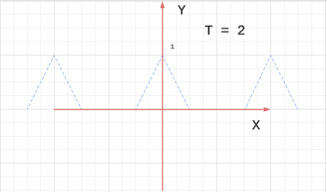

# 1. Fourier Series

## 1.1. Playing with Fourier series using MATLAB

**Solution**: Since I do not have the matlab code yet,
I use python to draw the following:

```python
import numpy as np
import matplotlib.pyplot as plt
from matplotlib.ticker import MultipleLocator

# ex 1.1

# Generate x values from 0 to 10 with a step of 0.1
t = np.arange(0, 2, 0.01)

# Calculate the amplitude as the sine of the time values
f = np.zeros_like(t)
for n in range(5):
    amp = -15.0 / (1+n);
    phase = -0.1 * n
    f += amp * np.sin(2*np.pi*n*t + phase)

# Plot the sine wave
plt.plot(t, f)

# Add labels and title
plt.title('Sine wave')
plt.xlabel('Time')
plt.ylabel('Amplitude = sin(time)')
plt.gca().xaxis.set_major_locator(MultipleLocator(0.2))

# Add a grid and a horizontal line at y=0
plt.grid(True, which='both')
plt.axhline(y=0, color='k')

# Display the plot
plt.show()
```


## 1.2. Adding periodic functions

You can sometimes be misled by thinking too casually about 
modifying or combining periodic functions: scaling a periodic 
function results in a periodic
function; shifting a periodic function results in a periodic 
function. What about adding?

(a) Let $f(x) = \sin(2πmx) + \sin(2πnx)$ where $n$ and $m$ are positive integers. Is $f(x)$ periodic? If so, what is its period?

**Solution**:

Yes, because apprantly $f(x+1) = f(x)$.
If $d = \gcd(m, n)$, then $T = \frac{1}{d}$.

I cannot prove it though.

(b) Let $g(x) = \sin(2πpx) + \sin(2πqx)$ where $p$ and $q$ are 
positive rational numbers (say $p= m/r$ and $q= n/s$, as fractions 
in lowest terms). Is $g(x)$ periodic? If so, what is its period?

**Solution**:

Yes, the period is

$$ 
\frac{\text{lcm}(r,s)}{\gcd(m,n)}
$$

$\square$

(c) It’s not true that the sum of two periodic functions is 
periodic. For example, show that $f(t) = \cos t+\cos \sqrt[]{2} t$ 
is not periodic. (Hint: Suppose by way of contradiction that there 
is some $T$ such that $f(t+T) = f(t)$
for all $t$. In particular, the maximum value of $f(t)$ repeats. 
This will lead to a contradiction.)

**Proof**: 

Based on the hint, note that when $t=0$, $f(t)$ reaches its
maximum, i.e. $2$. Note assume $f(t+T) = f(t)$, especially
$f(T) = f(0) = 2$ 
.

$$ 
T = 2 n \pi \\
\sqrt[]{2} T = 2 m \pi \\
$$

Then we have

$$ 
\sqrt[]{2} = \frac{m}{n}
$$

This is not possible.

So $f(t)$ is not a periodic function.

## 1.3 Periods of sums and products

Let $f(t) = \sin3t+\cos5t$ and $g(t) = \sin3t·\cos5t$

(a) What is the period of $f(t)$?
Find the Fourier series for $f(t)$.

**Solution**:

The period of $\sin 3t$ is $2/3 \pi$, and the period of $\cos5t$
is $2/5 \pi$. Since $3, 5$ are coprime, then their common period
has to be $2 \pi$.

$$
\begin{split}
c_n &= \frac{1}{2π} \int_{0}^{2 \pi } \sin 3t · e^{-2πint / (2π)} \\
&= \frac{1}{2π} \int_{0}^{2 \pi } \sin 3t · e^{-int} \\
&= \frac{1}{2π} \int_{-\pi}^{\pi} \sin 3t · (\cos (-nt) + i \sin (-nt)) \\
&= \frac{1}{2π} \int_{-\pi}^{\pi} \sin 3t · (\cos (nt) - i \sin (nt)) \\
\end{split}
$$

We use the conclusion from Understanding Analysis Exercise 8.5.2.

$$ 
c_n =
\begin{cases}
    -i/2 &\text{if }  n = 3  \\
    i/2 &\text{if } n = -3 \\
    0 &\text{else}\\
\end{cases}
$$

So

$$ 
\sin 3t = \frac{i}{2} e^{-3it} - \frac{i}{2} e^{3it}
$$

On the hindsight, we can just use the complex number knowledge in
Appendix B to get this.

For the same reason

$$ 
\cos 5t = \frac{1}{2} e^{5it} - \frac{1}{2} e^{-5it}
$$

So

$$ 
\sin 3t + \cos 5t =
- \frac{1}{2} e^{-5it} + \frac{i}{2} e^{-3it}
- \frac{i}{2} e^{3it} + \frac{1}{2} e^{5it}
$$

$\square$

(b) Find the Fourier series for $g(t)$. What is the period of
$g(t)$? (The period of the product is more interesting. The 
product repeats every $2π$, that is, $g(t+2π) = g(t)$, so the 
period of $g(t)$ is a divisor of $2π$. To determine the 
fundamental frequency of $g(t)$, we find its Fourier series.)

**Solution**:

$$
\begin{split}
\sin3t·\cos5t &=
\frac{e^{3it} - e^{-3it}}{2i} \cdot
\frac{e^{5it} + e^{-5it}}{2} \\
&=\frac{1}{4i}
(-e^{-8it} + e^{-2it} - e^{2it} + e^{8it})
\end{split}
$$

From this Fourier series, we can see, $π$ is a period.

$$ 
\sin 3(t+π) \cdot \cos 5(t+π) \\
= (- \sin 3t) \cdot (-\cos 5(t)) \\
= \sin3t·\cos5t
$$

$\square$

## 1.4 Different definitions of periodicity

(a) Show that $f(t)$ is periodic of period $p$ if and only if
$f(t−p) = f(t)$ for all $t$. The upshot is that it doesn’t matter 
if we define periodicity as $f(t+p) = f(t)$ or as $f(t−p) = f(t)$.

**Proof**:

If $f(t)$ is periodic, then $f(t+p) = f(t)$,
let $s = t + p$, then $t = s - p$. So we have

$$ 
f(s−p) = f(s), \forall s
$$

The other side is the same.

$\square$

(b) Show that $f(t)$ is periodic of period $p$ if and only if
$f(t + p/2) = f(t−p/2)$ for all $t$.

**Proof**: 

If $f(t)$ is periodic, then $f(t+p) = f(t)$,
let $s = t - p/2$, then $t = s + p/2$. So we have

$$ 
f(s + p/2) = f(s−p/2), \forall s
$$

The other side is the same.

$\square$

## 1.5. Overheard at a problem session ...

Suppose two sinusoids have the same frequency but possibly 
different amplitudes and phases. What about their sum? Each of the 
following answers was proposed at a problem session:

(a) Has twice the frequency of the original sinusoids.

(b) Is either zero or has exactly the same frequency as the original sinusoids.

(c) May exhibit beats.

(d) Is not necessarily periodic at all.

Which is correct, and why?
(Hint: Think in terms of complex exponentials.)

**Solution**: This is covered at the end of Appendix B.

$\square$

## 1.6. Low voltage

A periodic voltage is given by

$$ 
v(t) = 3 \cos (2πν_1t−1.3)+5 \cos (2πν_2t+0.5).
$$

Regardless of the frequencies $ν_1$, $ν_2$, the maximum voltage is 
always less than $8$, but it can be much smaller. Use MATLAB (or 
another program) to find
the maximum voltage if $ν_1 = 2$ Hz and $ν_2 = 1$ Hz.

**Solution**:

Here is the python code

```python
t = np.arange(0, 2, 0.01)

f = 3 * np.cos(2 * np.pi * 2 * t - 1.3) + 5 * np.cos(2 * np.pi * 1 * t + 0.5)
plt.plot(t, f)
plt.show()

print(max(np.around(f, 4)), min(np.around(f, 4)))
5.7807 -7.6865
```

## 1.7. Periodizing a triangle

The triangle function with a parameter $p > 0$ is

$$ 
\Lambda_p(t) =
\begin{cases}
    1 - \frac{1}{p}|t|, &|t| \leq p, \\
    0, &|t| \geq p. \\
\end{cases}  
$$

We’ll be seeing it a lot. When $p = 1$
(the model case in many instances), we simplify the notation to 
just $Λ(t)$.

Note that $Λ_p(t) = Λ(t/p)$.

The parameter $p$ specifies the length of the base, namely $2p$. 
Alternately, $p$ determines the slopes of the sides: the left side 
has slope $1/p$ and the right side has slope $−1/p$.

Now for $T > 0$ define

$$ 
g(t) = \sum_{n = -\infty}^{\infty}
Λ_p(t - nT)
$$

Anwser:

(a) For $p = 1/2$ and $T = 1/2, T = 3/4, T = 1, T = 2$,
sketch the graphs of $g(t)$. Periodic? In each case what is the 
period?

**Solution**:




The period are $0, 6/8, 1, 2$ respectively.

(b) In which of these cases is it possible to recover the original 
signal $Λ_{1/2}(t)$ from the sum $g(t)$? What operation would you 
apply to $g(t)$ to do this?

**Solution**:

When $T = 1, 2$. We can times $g(t)$ with the following $h(t)$

$$ 
h(t) =
\begin{cases}
    1 &\text{if } -1/2 \leq t \leq 1/2 \\
    0 &\text{otherwise } \\
\end{cases} 
$$

$\square$

(c) In general, what condition on $p$ and $T$ will guarantee that 
$Λ_p(t)$ can be recovered from the sum $g(t)$?

**Solution**:

In general, we need $T \geq 2p$.

$\square$
